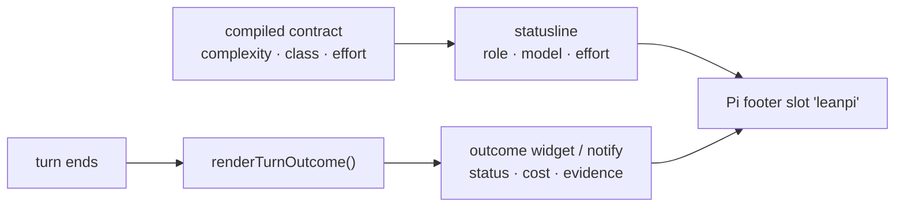

# Statusline & UI

**Plane:** surface · **Entry symbol:** `LEANPI_STATUS_KEY`, `renderTurnOutcome()` · **Spec:** PRD-016

"Tell me your goal, I figure out the rest" only works if the figuring is
visible. The status line renders the decisions the compiler made for the turn in
flight — but only the ones an operator can read at a glance and act on.

What it deliberately does **not** say: which internal lane ran. "Pi loop" and
"Executor lane" name LeanPi's own plumbing, and an operator who cannot change the
lane cannot use the word.

## Flow

## Modules

| Module | Owns |
| --- | --- |
| `src/cli/statusline.ts` | the one footer line: chips for role/model, reasoning level, complexity, lane |
| `src/cli/outcome.ts` | `renderTurnOutcome()` — the deterministic half of what a turn did |
| `src/cli/spinner.ts` | the working indicator |
| `src/cli/todo-widget.ts` | the live todo list above the prompt |
| `src/cli/recap-widget.ts` | the recap widget slot (`LEANPI_RECAP_WIDGET_KEY`) |
| `src/cli/usage.ts`, `usage-picker.ts` | the two-pane `/usage` quota view |
| `src/cli/model-picker.ts`, `update-check.ts`, `ui-settings.ts`, `startup-trace.ts`, `fold-cache.ts` | pickers, update notice, UI prefs, startup timing |

## Read more

- [Command surface](./command-surface.md), [Session recap](./session-recap.md), [Todo list](./todo-list.md)
