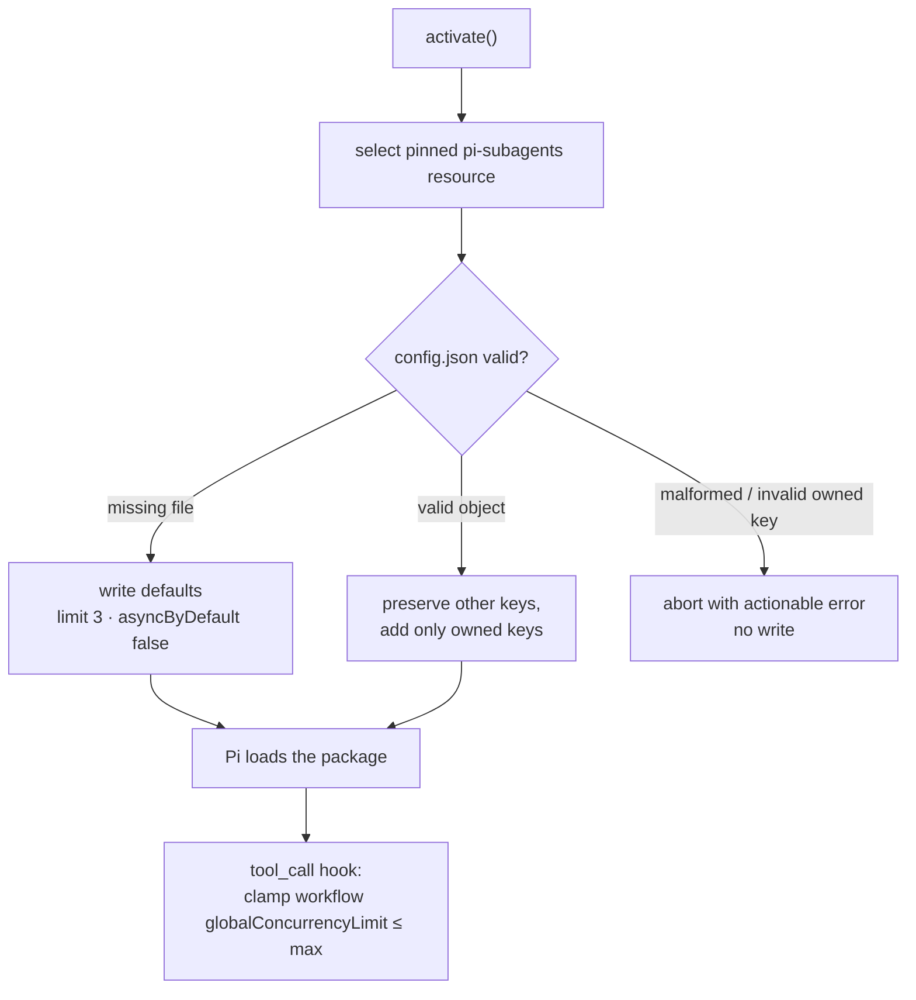

# Subagents

**Plane:** decision · **Entry symbol:** `ensureDefaultConfig()`, `clampSubagentOverride()` · **Spec:** PRD-041, PRD-049

LeanPi selects the one pinned `pi-subagents` resource path and lets Pi's native
loader attach it. It owns two things the package does not: the operator's per-run
child concurrency limit, and a shipped default that works with LeanPi's
registered-only native models.

## Flow

## Rules

- Upstream's own config path: `getAgentDir()` + `extensions/subagent/config.json`.
  LeanPi writes only the keys it owns and preserves every other key, because the
  file is shared with upstream's other settings.
- A malformed or unsafe file aborts selection with an actionable error **before**
  anything loads, so a session never runs with a silently clamped cap against a
  file it does not understand.
- `asyncByDefault: false` is deliberate: LeanPi registers only native models, so
  an async child (an external process) cannot see the parent's provider. Async
  still works when the operator names a child-visible provider/model.
- `clampSubagentOverride` clamps a model-issued `globalConcurrencyLimit` down to
  the operator max; a lower explicit value is left alone — the operator max is a
  ceiling, not a floor.
- PRD-049 adds JEV routing of each child's model and effort, on the parent's side.

## Modules

| Module | Owns |
| --- | --- |
| `src/subagents/index.ts` | selection, config read/write, `ensureDefaultConfig()`, `inspectOperatorLimit()`, `setLimit()`, `clampSubagentOverride()` |
| `src/subagents/route.ts` | per-child model/effort routing (PRD-049) |
| `src/commands/subagents-limit.ts` | `/subagents-limit` |

## Config keys LeanPi owns

| Key | Default | Meaning |
| --- | --- | --- |
| `globalConcurrencyLimit` | 3 | max concurrent child runs |
| `asyncByDefault` | false | async children need a child-visible provider |

## Read more

- [Command surface](./command-surface.md), [Routing & capability index](./routing-and-capability.md)
