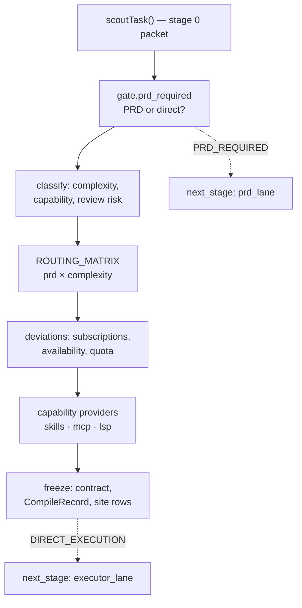

# Task compiler

**Plane:** decision · **Entry symbol:** `compileTask()` · **Spec:** PRD-004

The compiler turns a request plus the scout packet into an `ExecutionContract`
*before* any expensive model sees it. The contract is the executor's only input:
the executor does not get the repository to re-read and re-derive what the
compiler already decided. JEV-off is a first-class path — a JEV failure never
throws out of `compileTask` (`ROADMAP §49`).

## Pipeline

Every JEV answer that enters is a scalar, enum or score; the contract is
assembled in ordinary code. The only generative calls are the JEV sites, which
answer from the request, the packet and telemetry.

## The contract

`ExecutionContract` (`src/compiler/contract.ts`) is the only thing the executor
may read, and the only thing a reviewer is told about the task.

| Field | Holds |
| --- | --- |
| `task` | type, `planning_decision`, `execution_complexity` (LOW/MEDIUM/HIGH), `review_risk` (R0–R3), `required_capability`, the request verbatim, the objective, `acceptance_criteria[]` |
| `task.routing` | `executor_class` (quick/balanced/strong/specialist), `reviewer_class` (none/review_quick/review_strong), `deviation` when the matrix default was left |
| `reasoning` | `effort` — low/medium/high |
| `capabilities` | `skills[]`, `mcps[]`, `lsp` flag, `rtk` mode — the disclosure decision, frozen |
| `context` | `strategy` (targeted/broad), `budget_tokens` |
| `verification` | `required[]` verifier kinds, plus per-criterion attribution when the compiler can name a surface |
| `limits` | `execution_attempts`, `max_escalations`, `semantic_review_rounds`, `isolation` (none/worktree) |

## Modules

| Module | Owns |
| --- | --- |
| `src/compiler/index.ts` | `compileTask()`, `registerCapabilityProvider()`, `setCompilerContext()`, `compileRecordOf()` |
| `src/compiler/gate.ts` | `gate.prd_required` (PRD_REQUIRED / DIRECT_EXECUTION / UNCERTAIN) |
| `src/compiler/classify.ts` | complexity, required capability, review risk |
| `src/compiler/route.ts` | `ROUTING_MATRIX` application |
| `src/compiler/contract.ts` | the contract types |
| `src/compiler/state.ts` | the per-turn frozen state |
| `src/compiler/pins.ts` | `routePins()` — PRD-048 operator-pinned route |

## JEV sites owned

`gate.prd_required`, `classify.execution_complexity`,
`classify.required_capability`, `classify.review_risk_input`.

## Read more

- [Architecture §5–§6](../architecture/README.md), [Cost strategies §1](../architecture/cost-strategies.md)
- [Task scout](./task-scout.md), [JEV control plane](./jev-control-plane.md), [Routing & capability index](./routing-and-capability.md)
