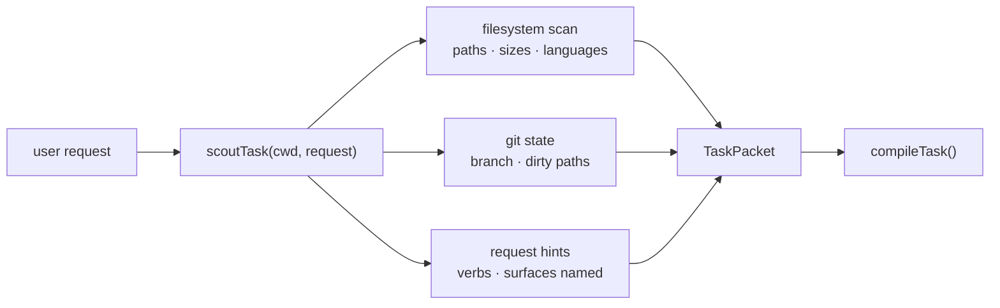

# Task scout

**Plane:** decision · **Entry symbol:** `scoutTask()` · **Spec:** PRD-003

Stage 0 of the compiler: read the request and the repository layout into a
deterministic packet. Nothing in the packet asks a model to read the repository —
it is file names, sizes, git state and language hints, gathered locally.

## Flow

## Modules

| Module | Owns |
| --- | --- |
| `src/scout/index.ts` | `scoutTask()`, `TaskPacket` — the only file in the system |

## Packet consumers

The packet is the deterministic input to [task compilation](./task-compiler.md)
and seeds the [exploration governor](./exploration-governor.md). It carries no
model output, so it is stable per workspace state and safe to cache.

## Read more

- [Architecture §5](../architecture/README.md), [Task compiler](./task-compiler.md)
