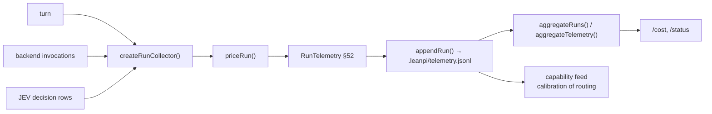

# Telemetry & cost

**Plane:** state & policy · **Entry symbol:** `emitRunTelemetry()`, `aggregateRuns()`, `priceRun()` · **Spec:** PRD-015

One `ROADMAP §52` record per run, its store, its aggregates and the `/cost`
surface. `effective_cost` is a **measurement**; routing's pre-dispatch
`route_cost` is a **prediction**, and the two are never summed.

```
effective_cost = api_usd + jev_usd + estimated_quota_cost + local_compute + latency
```

## Flow



## Record shape

| Field | Holds |
| --- | --- |
| `task_id`, `session_id` | run identity |
| `route` | complexity, executor_class, reviewer_class, reasoning |
| `executor_backend`, `executor_model`, `reviewer_backend`, `reviewer_model` | the identities actually used |
| `usage`, `cost`, `execution` | tokens, priced total, wall time |
| `result` | verification, proof_gate, reviewer, success |
| `capabilities` | skills/mcps disclosed and used |
| `jev_decisions`, `calls` | decision rows and backend calls |

A recap writes its own row (`recapRun`) so the extra model call per turn is
visible in the cost the user reads with `/status`.

## Modules

| Module | Owns |
| --- | --- |
| `src/telemetry/emit.ts` | `emitRunTelemetry()` |
| `src/telemetry/collect.ts` | `createRunCollector()`, `feedInvocation()` |
| `src/telemetry/cost.ts` | `resolveCostConfig()`, `runTurnWithTelemetry()` |
| `src/telemetry/pricing.ts` | `priceRun()`, rate cards |
| `src/telemetry/store.ts` | `appendRun()`, `readRuns()` |
| `src/telemetry/aggregate.ts` | `aggregateRuns()`, `aggregateTelemetry()` |
| `src/telemetry/record.ts` | `RunTelemetry`, `RouteCostBlock` |

## Where it lands

`.leanpi/telemetry.jsonl` (`cost.telemetry_path` overrides). It feeds both the
cost surface and the capability index's calibration, closing the routing loop.

## Read more

- [Architecture §10](../architecture/README.md), [Cost strategies §8](../architecture/cost-strategies.md)
- [Routing & capability index](./routing-and-capability.md), [Bench harness](./bench-harness.md)
