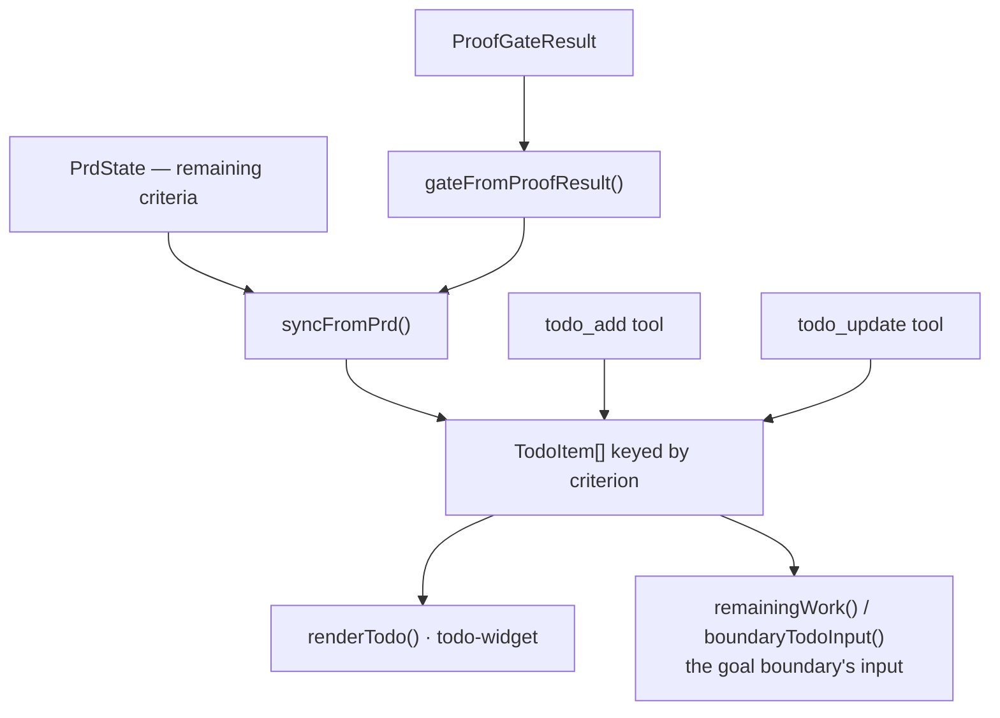

# Todo list

**Plane:** state & policy · **Entry symbol:** `createTodoHandler()`, `syncFromPrd()` · **Spec:** PRD-025

With an active PRD the list is not hand-maintained: `syncFromPrd()` reads the PRD
lane's remaining criteria and reconciles them into items keyed by `criterion`, so
a sync is idempotent and never duplicates an item, and a criterion that reopens
re-enters at its original position rather than at the end.

## Flow

Status follows the proof gate, not the author:

| Gate decision | Item status |
| --- | --- |
| `PASS` | `done` |
| `MISSING_PROOF` / `FAILED` | `pending` (the active item stays `in_progress`) |
| `BLOCKED` | `blocked`, with the gate's reason |
| no verdict | not `PASS`, so a previously `done` item reopens |

Nothing in the module writes `done` itself: the only writer is `completeItem`,
and it consults the same gate.

## Modules

| Module | Owns |
| --- | --- |
| `src/todo/state.ts` | `createTodoList()`, transitions, `activeItem()`, `promoteNext()` |
| `src/todo/derive.ts` | `syncFromPrd()`, `gateFromProofResult()` |
| `src/todo/render.ts` | `renderTodo()`, `withTodo()`, `TODO_ADD_TOOL`, `TODO_UPDATE_TOOL`, prompt budget |
| `src/todo/tool.ts` | `registerTodoTool()`, `registerTodoUpdateTool()` |
| `src/todo/goal.ts` | `remainingWork()`, `boundaryTodoInput()` |
| `src/todo/commands.ts` | `/todo`; `createTodoHandler()` |

## Read more

- [PRD-025](../PRDs/v1/done/PRD-025-todo-list.md)
- [PRD lane](./prd-lane.md), [Proof gate](./proof-gate.md), [Goal engine](./goal-engine.md), [Statusline & UI](./statusline-and-ui.md)
