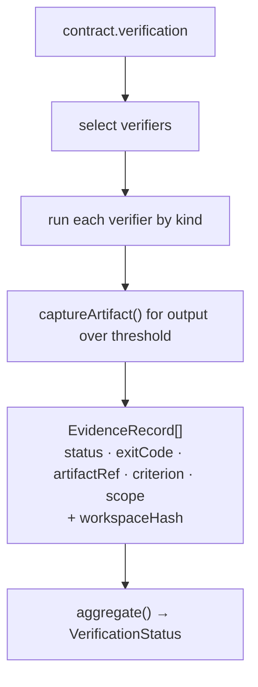

# Verification

**Plane:** evidence · **Entry symbol:** `verifyTask()` · **Spec:** PRD-009

Selection → execution → storage, in that order, with the workspace hash captured
**once at run start** so every record of one run shares one provenance stamp.
The returned status is the aggregate and only the aggregate: no parameter, and no
semantic answer, can raise it. Nothing here requires network, a JEV key or a
model.

## Flow

Records are fresh only when their `workspaceHash` matches the workspace at read
time, which is what makes "the tests passed" mean *after* the last edit. A hash
recomputed by the caller would read every record as stale.

## Verifier kinds

| Kind | Implemented by | Notes |
| --- | --- | --- |
| `typecheck`, `targeted_test`, `full_suite`, `lint`, `build`, `git_status` | `src/verify/descriptors.ts` | shelled commands; defaults in `DEFAULT_COMMANDS`, overridable per project |
| `runtime_smoke`, `cli_invocation`, `browser_test`, `screenshot_compare` | [runtime verification](./runtime-verification.md) | declared by the trusted `verify.runtime` block; without one they record `not_run`/`unavailable`, never a pass |

Downgrades are always recorded rather than implied: an unsupported kind is
`skipped`, a missing baseline is `unavailable`, a missing plan is `not_run`.

## Modules

| Module | Owns |
| --- | --- |
| `src/verify/index.ts` | `verifyTask()` |
| `src/verify/descriptors.ts` | `registerVerifier()`, `verifierFor()`, `VerifierDescriptor`, `captureArtifact()` |
| `src/verify/select.ts` | verifier selection from the contract, `targetedSurfaceOf()` |
| `src/verify/run.ts` | `ShellExec`, command execution |
| `src/verify/evidence.ts` | `EvidenceRecord`, `EvidenceStore` |
| `src/verify/hash.ts` | `workspaceHash()` |
| `src/verify/aggregate.ts` | `aggregate()`, `VerificationStatus` |

JEV site: `verify.regression_scope`.

## Read more

- [Architecture §9](../architecture/README.md), [PRD-009](../PRDs/v1/done/PRD-009-deterministic-verification.md)
- [Proof gate](./proof-gate.md), [Runtime verification](./runtime-verification.md), [Executor lane](./executor-lane.md)
